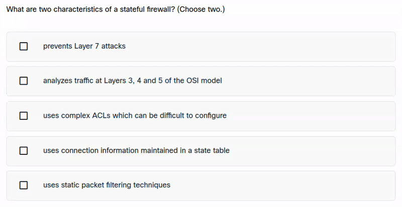

<a href="https://chromewebstore.google.com/detail/meowcad-solver/ngkonaonfgfbnobbacojipgndihanmca"></a>
<a href="https://addons.mozilla.org/en-US/firefox/addon/meowcad-solver/"></a>

# NetAcad Solver

I built this browser extension to make NetAcad quizzes and lessons fast and painless.


## What it does

- Auto-selects the right answers on quiz questions
- Hover + Ctrl to auto-select answers without clicking
- Auto-skips lesson videos when detected
- One-click "Skip Lecture" button
- Popup toggles for auto-select, preview-only mode, status panel, and debug logs

## Install

### Store install

- Chrome Web Store: https://chromewebstore.google.com/detail/meowcad-solver/ngkonaonfgfbnobbacojipgndihanmca
- Firefox Add-ons: https://addons.mozilla.org/en-US/firefox/addon/meowcad-solver/

### Manual install

<details>
  <summary>Chromium (click)</summary>

1. Go to the latest release: https://github.com/thecodermusab/cisco/releases/latest
2. Download `netacad-solver-0.x.x-manifest-v3.crx`
3. Open chrome://extensions/
4. Enable "Developer mode"
5. Drag and drop the .crx file into the extensions page

</details>

<details>
  <summary>Firefox (click)</summary>

1. Go to the latest release: https://github.com/thecodermusab/cisco/releases/latest
2. Download `netacad-solver-0.x.x-manifest-v2.xpi`
3. Open the file in Firefox and confirm the install

</details>

## Usage

1. Open your course at https://netacad.com/
2. Click a question or use Ctrl + hover on answers
3. Use the popup to toggle features




## Development

```sh
npm install
npm run build
```

Load the `dist/` folder as an unpacked extension.

For live rebuilds:

```sh
npm run start
```

## Supported browsers

- Firefox
- Chrome
- Opera
- Brave
- Vivaldi
- Most Chromium browsers

## Ideas to improve

- Per-course selector profiles editable in the popup
- MutationObserver-based detection to reduce polling and CPU usage
- Status panel customization (position, compact mode)
- Export/import settings for easy sharing
- Multi-language popup labels
- Per-question-type toggles for advanced control
